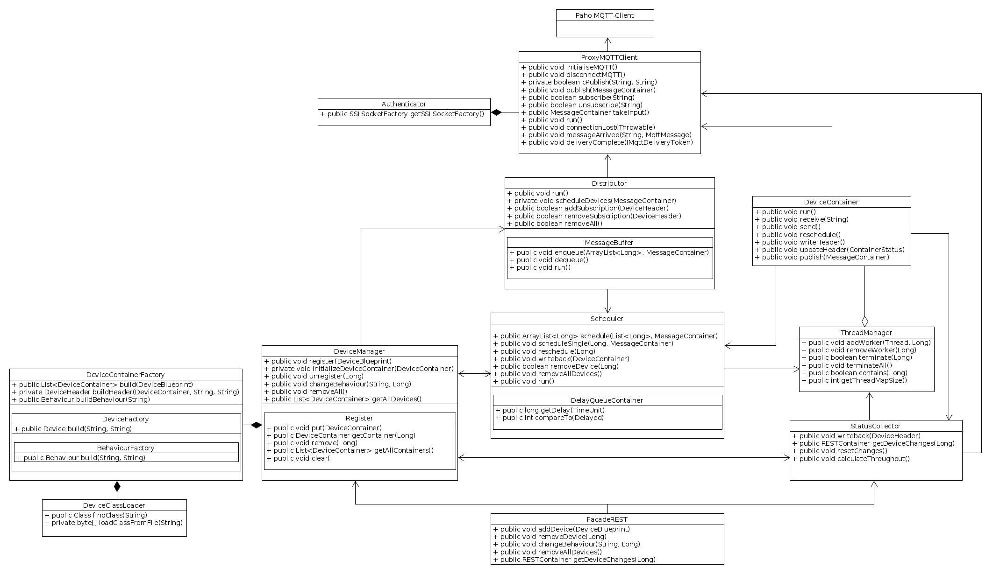
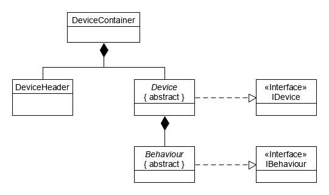

# SmartCityEnvSim

## Aufbau

Allgemeiner Aufbau der Software. Es wird der Paho-MQTT-Client verwendet.



## Virtuelle Geräte

Zum Erzeugen eigener virtueller Geräte werden die abstrakten Klassen 'Device' und 'Behaviour' sowie die Utility-Klasse 'MessageContainer' benötigt. 



Die kompilierten .class Dateien können dann zur Ausführung der Geräte genutzt werden.

## Deployment und Ausführung

Die Anwendung ist für die Ausführung als Docker Container vorgesehen. Dazu befindet sich ein entsprechendes Dockerfile im Repository. 

#### Compilieren:

Es handelt sich um ein Maven Projekt. Die Anwendung kann also einfach mit Hilfe von Maven übersetzt werden.

```sh
mvn clean
mvn package -DskipTests
```

Wenn das Ausführen der vorhandenen Tests gewünscht ist, muss der lokale Pfad zu einem 'EnvSimResources'-Ordner in der Klasse 'testUtils' eingetragen werden. 
Ein solcher Ordner liegt bereits im Repository bei. 

SmartCityEnvSim/src/test/java/testUtil/testUtils.java 


```sh
14:   ReflectionTestUtils.setField(manager, "path", "/home/dbuech/workspace/EnvSim/EnvSimResources/");
```


#### Erzeugung des Image:

Das Image der Anwendung kann durch Aufruf des Docker build-Befehls im root-Verzeichnis des Repositorys erstellt werden.

```sh
docker build -t [TAG:VERSION] . 
```

Siehe auch: https://docs.docker.com/engine/reference/commandline/build/ [27. August 2020]

#### Ausführen des Containers 

Zur Ausführung wird ein lokaler Ordner benötigt, der folgende Dateien enthält:

(`Es kann der Ordner 'EnvSimResources' des Repositorys genutzt werden. Dieser enthält bereits die erforderlichen 
Zertifikate und Zugangsdaten für den Broker der htw saar. Die angefügten Beispielgeräte setzen Zugang zu der Subtopic
data/Gruppe11/# voraus. Die Konfigurationsdatei enthält die Zugangsdaten zum Broker in !Klartext! und ist vor Weitergabe
oder Veröffentlichung des Repositorys zu entfernen!`)

##### 'config.properties' (Keine andere Benennung erlaubt):

Konfigurationsdatei der Anwendung

| Parameter | Wert |
| ------ | ------ |
| MQTT.INPUT.BUFFER.SIZE | Größe des MQTT-Eingabepuffers (> 0)  |
| MQTT.OUTPUT.BUFFER.SIZE | Größe des MQTT-Ausgabepuffers (> 0) |
| MQTT.QOS | Quality of Service-Level des MQTT-Clients (0) |
| MQTT.BROKER | Adresse des MQTT-Brokers (z.B. ssl://xxx.xxx.xxx.xxx:xxxx) |
| MQTT.USERNAME | Falls die Verbindung einen Nutzernamen erfordert |
| MQTT.PASSWORD | Falls die Verbindung ein Passwort erfordert |
| MQTT.CLIENT&#46;ID | ID, welche der MQTT-Client verwenden soll |
| DISTRIBUTER.BUFFER.SIZE | Größe des individuellen Nachrichtenpuffers der Geräte (> 0) |
| AUTHENTICATOR.PROTOCOL | Angabe des Verschlüsselungsprotokolls falls erforderlich (z.B. TLS) |
| AUTHENTICATOR.CERTIFICATE | Angabe einer vorhanden Zertifikatsdatei (z.B. XY.pem) |
| AUTHENTICATOR.CERTIFICATE.TYPE | Angabe des vorliegenden Zertifikatstyps (aktuell nur X.509 unterstützt) |
| CLI.INPUT | Name der zur Eingabe genutzten named pipe |
| CLI.OUTPUT | Name der zur Ausgabe genutzten named pipe |
| CLI.BENCHMARK | For future reference only (Beliebiger Wert, auch empty)  |

##### Eingabepipe:

Die Anwendung liest von dieser named pipe. Befehle an die Anwendung werden in die pipe geschrieben. Dadurch ist auch die Verwendung von Scripten möglich.

```sh
mkfifo $CLI.INPUT (siehe config-Datei)
```

##### Ausgabepipe:

Die Anwendung schreibt ihre Ausgaben in diese named pipe.

```sh
mkfifo $CLI.OUTPUT (siehe config-Datei)
```

##### Start

Darüber hinaus müssen sich die Klassen der virtuellen Geräte im Ordner oder einem Unterordner befinden. Liegen alle beschriebenen Ressourcen vor, kann die Anwendung durch folgenden Befehl gestartet werden: 

```sh
docker run -d -v /Pfad/zum/Ordner:/tmp/EnvSimResources --user $(id -u):$(id -g) --privileged [TAG:VERSION]
```

Zum direkten Überwachen der Anwendung ist auch das Starten ohne -d Flag möglich. 
Siehe auch: https://docs.docker.com/engine/reference/run/ [27. August 2020]

##### Überwachung

Zur Interaktion mit der Software und Überwachung von Ausgaben wird die Verwendung eines Terminalmultiplexers wie tmux empfohlen. Ein einfaches Setup besteht dabei aus:

Log-Daten: z.B. 
```sh
tail -f logs/spring-boot-logger.log
```

Ausgaben: z.B.
```sh
tail -f $CLI.OUTPUT (siehe config-Datei)
```

Eingaben: z.B.
```sh
echo 'Some Command' > input
```

#### Kompatibilitätsprobleme (z.B. MacOS Catalina)

Alle Docker-Versionen unterstützen zwar das mounten von named pipes auf einen Container, allerdings stehen dem Container auf bestimmten Systemen (z.B. MacOS) nicht die benötigten Status-Flags zur Verfügung, sodass ein lesen von und schreiben in named pipes unmöglich wird. [Stand Docker version 19.03.11]

Als Workaround bietet sich hier an eine Shell in dem Docker Container zu öffnen und die oben beschriebenen Befehle direkt auf den gemounteten named pipes auszuführen. 
```sh
docker exec -it <container name> /bin/ash
cd /tmp/EnvSimResources
...
```

Siehe auch: https://docs.docker.com/engine/reference/commandline/exec/ [27. August 2020]
